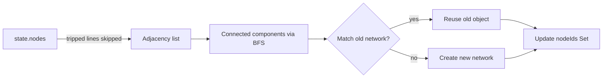
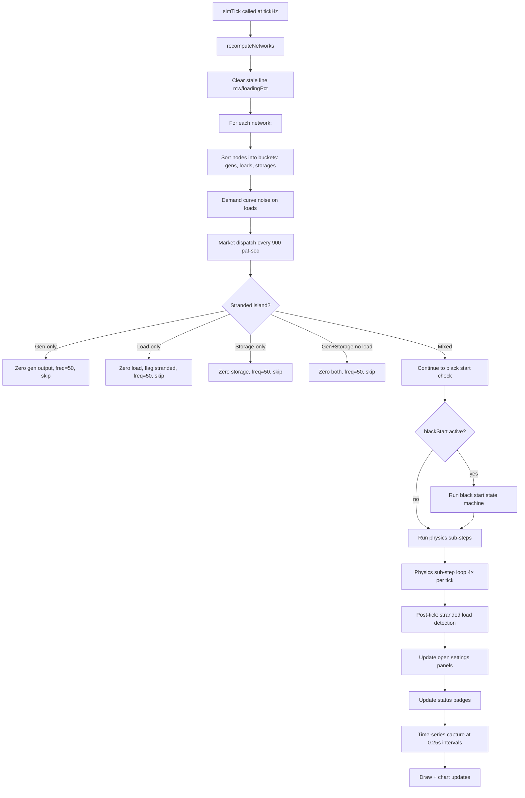
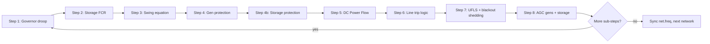
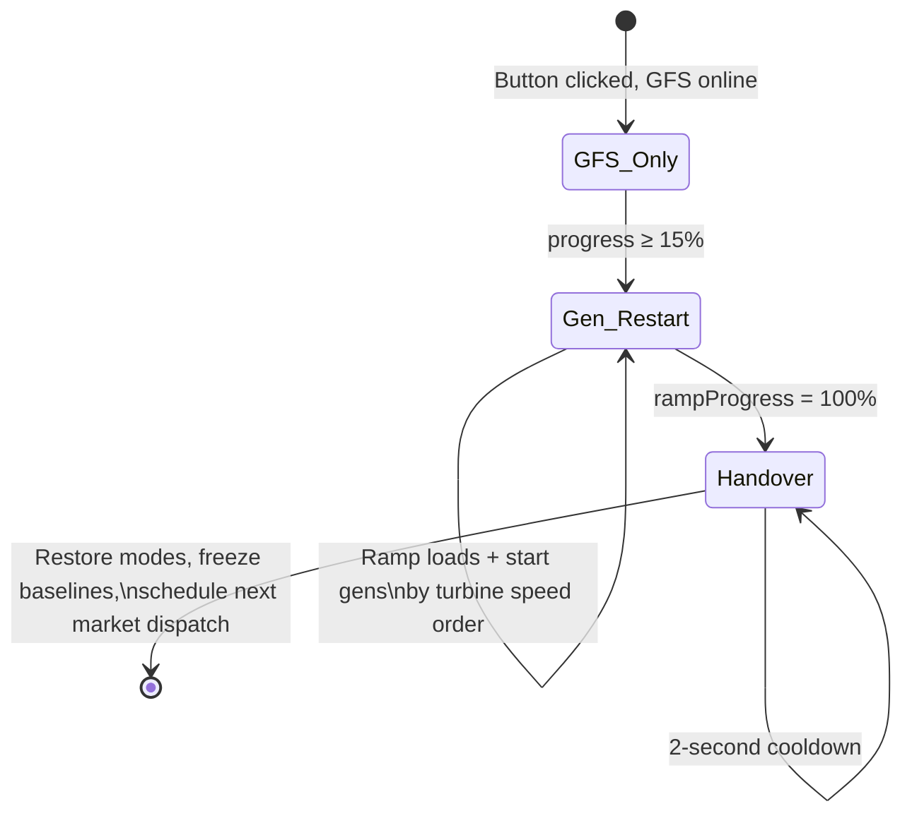
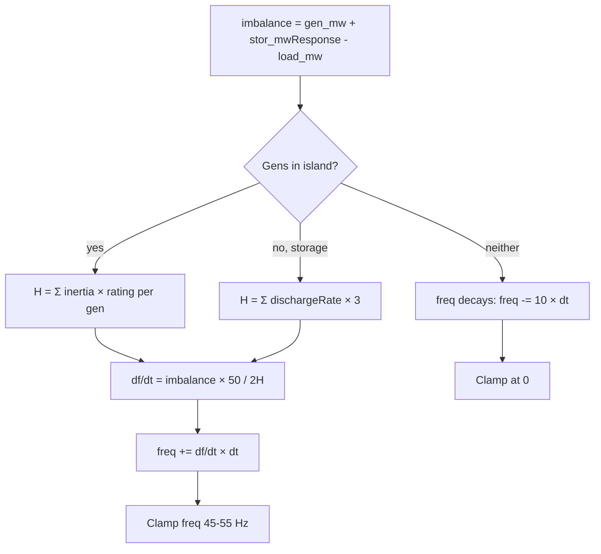
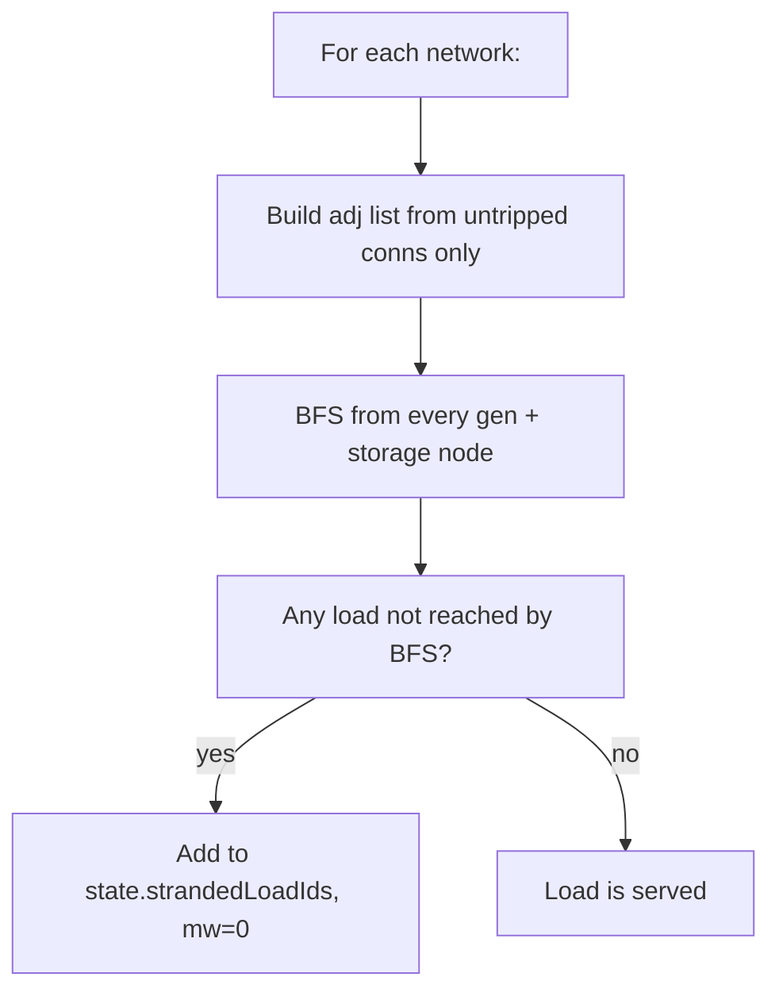

# Engine.js — Step-by-Step Walkthrough

> Guide to `public/simulation/Engine.js` (1433 lines)
> The heart of the power grid simulator

## 1. Class Overview

```js
export class SimulationEngine {
  constructor(store, callbacks) {
    this.onPersist = () => {};
    this.store = store;       // shared state object
    this.callbacks = callbacks; // { draw, updateControls, updateStatsPanel, drawFreqChart, drawMeritOrderChart }
  }
}
```

**`store`** — the single state container (`Store.js`). Holds `state` (nodes, connections, networks), `sim` (timing, tickHz, speed, dataBuffer), `openPanels`, UI flags.

**`callbacks`** — functions that the engine calls to update the UI. The engine is pure logic; callbacks bridge to canvas, DOM, and charts.

### Methods at a glance

| Method | Lines | Purpose |
|---|---|---|
| `findNetworks()` | 1371–1431 | BFS island detection |
| `recomputeNetworks()` | 10–19 | Refresh islands + init freqPrev |
| `demandCurve(t)` | 21–41 | Load shape by time of day/week |
| `dispatchMeritOrder()` | 43–76 | Cheapest-gen-first market dispatch |
| `simTick()` | 78–895 | **Main physics + UI loop** |
| `startSim()` / `stopSim()` / `restartSim()` | 897–968 | Lifecycle |
| `balanceGrid()` | 970–1116 | Manual supply-demand balance |
| `saveSnapshot()` | 1118–1151 | Persist to server |
| `solveDCPowerFlow(net)` | 1153–1336 | DC power flow solver |

---

## 2. Network Islands: `findNetworks()`

### Algorithm: BFS (Breadth-First Search)

```mermaid
flowchart TD
    A[Build adjacency list: every node = key, every connection adds both directions] --> B[Pick next unvisited node]
    B --> C{Visited?}
    C -->|Yes| B
    C -->|No| D[Start BFS: queue = [node], visited.add]
    D --> E[Shift from queue, add to nodeIds Set]
    E --> F{Neighbors left?}
    F -->|Yes| G{Neighbor visited?}
    G -->|No| H[visited.add, queue.push]
    G -->|Yes| F
    H --> F
    F -->|No| I{Queue empty?}
    I -->|No| E
    I -->|Yes| J[Push nodeIds Set as component]
    J --> K{All nodes visited?}
    K -->|No| B
    K -->|Yes| L[Reuse old network objects to preserve customName]
    L --> M[Return networks array]
```

**Key detail:** Each network object gets preserved across ticks via `setsEqual()` — if an island's `nodeIds` Set matches a previous tick, the same network object is reused (so `customName`, `blackStart`, `freqPrev` survive).



---

## 3. Load & Market

### `demandCurve()` — Load Profile

```mermaid
graph LR
    subgraph Inputs
        T[t = simTime * 720] --> TOD[hour of day 0-24]
        T --> DOW[day of week 0-6]
    end
    subgraph Formula
        TOD --> DAILY[0.5 - 0.45×cos((tod-4)/24 × 2π)]
        DAILY --> BUMP[+0.15 morning bump at 10AM]
        BUMP --> LUNCH[+0.05 lunch recovery at 2PM]
        LUNCH --> CLAMP[max(0, min(1, daily))]
        DOW --> WEEKEND[×0.85 on Sat/Sun]
        CLAMP --> WEEKEND
    end
    WEEKEND --> RESULT[Returns 0-1 multiplier]
```

The return value is a multiplier (0–1) applied to each load's `noiseMin`–`noiseMax` range, with random drift on top.

### `dispatchMeritOrder()` — Market

```mermaid
flowchart TD
    A[Filter untripped gens, exclude 'fixed' mode] --> B[Sort by bidPrice ascending]
    B --> C[Reset all non-fixed baselineContract = 0]
    C --> D[remaining = totalLoad]
    D --> E[For each gen in order:]
    E --> F[dispatch = min(remaining, bidQty)]
    F --> G[baselineContract = dispatch]
    G --> H[remaining -= dispatch]
    H --> I{dispatch > 0?}
    I -->|yes| J[smp = bidPrice]
    I -->|no| K[skip]
    J --> L{remaining > 0?}
    K --> L
    L -->|yes| E
    L -->|no| M[state.smp = smp or null if shortfall]
```

Runs every 900 pattern-seconds (≈ every 1.25 sim-seconds at 720× speed).

---

## 4. `simTick()` — The Main Loop

### High-Level Pipeline



### Physics Sub-Step Loop (runs 4× per tick for smoothness)



---

## 5. Black Start — 3-Phase State Machine



### Phase 1: GFS-Only (0% → 15%)
- Grid-Forming Storage energizes the dead bus
- No other generation runs
- At 15%, build `genOrder` sorted by `turbineTimeConstant` (fastest first)

### Phase 2: Gen-Restart (15% → 100%)
- Loads ramp from 0 → pre-blackout MW linearly with `rampProgress`
- Gens un-trip and start producing in order: when `rampProgress >= genStartPct`
- All gens locked to `mode: "fixed"` during ramp
- Each gen's `baselineContract = share_of_totalLoad × genLocalPct`

### Phase 3: Handover (2 seconds)
- Restore each gen's original mode
- Freeze `baselineContract = gen.mw`
- Zero load shedding, clear `_preBlackoutBaseMw`
- Force next market dispatch: `lastMarketPat = simTime * 720 - 900` (fires immediately)
- Delete `net.blackStart`, remove from `state.blackStartNets`

---

## 6. Physics Sub-Steps (Detailed)

### Step 1 — Governor Droop

```mermaid
flowchart TD
    A[For each untripped gen in island] --> B{Mode?}
    B -->|merchant/fixed| C[target = baselineContract]
    B -->|fcr-only| D[govMod = -(1/droop) × (f-f0)/f0 × rating]
    D --> E[target = baseline + govMod]
    B -->|balancing| F[govMod = same formula]
    F --> G[target = baseline + govMod + agcOffset]
    
    C --> H[Clamp 0 to rating]
    E --> H
    G --> H
    
    H --> I[Apply turbine time constant:]
    I --> J[mw += (target - mw) × dt / T]
    J --> K{target < current?}
    K -->|yes| L[T = rampDownTC<br>default 0.3s]
    K -->|no| M[T = turbineTimeConstant<br>default 1.0s]
```

### Step 2 — Storage FCR (4 Modes)

| Mode | Formula | Extra |
|---|---|---|
| `balancing` | target = bc + govMod + agcOffset | Clamped to [-chargeRate, dischargeRate] |
| `fcr-only` | target = bc + govMod | No AGC |
| `grid-forming` | target = bc + govMod + freqRestore | `freqRestore` integral: `∫ 5 × (50-f) dt` |
| `fixed` | target = bc + fixedTarget | Simple setpoint |

All modes: `mwResponse` smoothed with 0.1s time constant. SoC updated: `soc -= mwResponse × dt / 3600`.

### Step 3 — Swing Equation



### Step 4 — Generator Protection

```mermaid
flowchart TD
    A[For each gen (incl tripped)] --> B{freq > 52 or < 48?}
    B -->|yes| C[freqTimer += dt]
    C --> D{freqTimer ≥ 1s?}
    D -->|yes| E[Trip: tripped=true, mw=0, log event]
    D -->|no| F[Keep running]
    B -->|no| G[Reset freqTimer = 0]
```

**Storage protection** (Step 4b): Same logic but `grid-forming` storage is exempt (line 471: `if (st.tripped || st.mode === "grid-forming") continue`).

### Step 5 — DC Power Flow

See Section 9 for full details.

### Step 6 — Line Trip Logic

| Loading % | Time to Trip |
|---|---|
| >200% | 0.5s |
| 150–200% | 1.0s |
| 120–150% | 5.0s |
| 100–120% | ∞ (no trip) |

Each overloaded connection accumulates `tripTimer`. When it exceeds the threshold, `tripped=true` and an event is logged.

**Cascade effect:** Next tick, `findNetworks()` skips tripped lines → grid splits into more islands → physics redistributes → more lines may overload.

### Step 7 — UFLS

```mermaid
flowchart TD
    A[For each load] --> B{Island frequency?}
    B -->|< 49.0 Hz| C[Shed 10%]
    B -->|< 48.7 Hz| D[Shed 20%]
    B -->|< 48.5 Hz| E[Shed 30%]
    B -->|< 48.3 Hz| F[Shed 40%]
    B -->|< 48.0 Hz| G[Shed 50%]
    
    C --> H[load.mw = baseMw × (1 - shedPct)]
    D --> H
    E --> H
    F --> H
    G --> H
    B -->|≥ 49.95 Hz| I[Restore: mw = baseMw]
```

Shedding **latches up** — if freq drops to 48.5, it stays at 30% even if freq rises to 48.6. Only restores when freq ≥ 49.95 Hz.

**Blackout load shedding** (Step 7b): When loads exist but no gens (island powered only by grid-forming storage), loads are capped to 50% of GFS discharge capacity.

### Step 8 — AGC

```mermaid
flowchart TD
    A[freqErr = 50 - freq] --> B{balancingGens > 0?}
    B -->|yes| C[totalAgc = 50 × freqErr × dt]
    C --> D[For each balancing gen:]
    D --> E{headroom in needed direction?}
    E -->|upward| F[headroom = rating - mw - fcrHeadroom]
    E -->|downward| G[headroom = mw - fcrHeadroom]
    F --> H{totalDirHeadroom > 0?}
    G --> H
    H -->|yes| I[share = headroom / totalDirHeadroom]
    I --> J[agcDelta = totalAgc × share]
    J --> K[agcOffset += clamp(agcDelta, ±5×dt)]
    K --> L[Anti-windup: clamp agcOffset to [-bc, rating-bc]]
    H -->|no| M[skip gen]
```

**Storage AGC** (Step 8b): Similar but with `agcRateLimit = 20` and total headroom computed from discharge + charge rates.

---

## 7. Post-Tick Processing (lines 678–895)

### Stranded Load Detection

Inside each island, a **second BFS** runs on *active (untripped)* connections only:



This catches loads connected only via tripped lines within a mixed island — they have gen+load in the same island, but the load's path to generation is broken.

### UI Updates

- **Open panels:** MW readouts, baseline sliders, shutdown buttons updated per open panel
- **Status badges:** FCR active/inactive, AGC active/inactive
- **Stats panel:** `updateStatsPanel()` callback
- **Time-series capture:** Every 0.25s, snapshots node MW, connection flows, island membership, events

---

## 8. Lifecycle Methods

### `startSim()`
```js
sim.interval = setInterval(() => this.simTick(), 1000 / sim.tickHz);
```

### `stopSim()`
Clears the interval, sets `sim.running = false`.

### `restartSim()`
```mermaid
flowchart TD
    A[stopSim] --> B[Reset sim time: dataBuffer=[], events=[], simTime=0]
    B --> C[Reset all gens: agcOffset=0, mw=baseline, tripped=false]
    C --> D[Reset all storage: mwResponse=baseline, freqRestore=0]
    D --> E[Reset all loads: shedPct=0, mw=baseMw]
    E --> F[Untrip all connections]
    F --> G[Rebuild networks, set all freq = 50]
    G --> H[Clear black start state]
    H --> I[Draw + update UI]
```

### `balanceGrid()`
Manual button that:
1. Resets everything (trips, shedding, AGC)
2. Per island: distributes load proportionally by rating across flexible gens + storage
3. Handles surplus by charging storage
4. Rebuilds networks and updates UI

---

## 9. `solveDCPowerFlow(net)` — Deep Dive

```mermaid
flowchart TD
    A[Get all nodes + untripped connections in island] --> B{Build connected components<br>within the active graph}
    B --> C[For each component with ≥2 nodes:]
    C --> D[Build B' matrix:<br>B[i][i] = Σ 1/X_ij<br>B[i][j] = -1/X_ij]
    D --> E[Build P vector:<br>P[i] = +gen_mw - load_mw + stor_mwResponse]
    E --> F[Pick slack bus:<br>largest untripped gen,<br>or largest storage,<br>or index 0]
    F --> G[Remove slack row/col → reduced B'r + P'r]
    G --> H[Gaussian elimination on B'r]
    H --> I[Back-substitution → θ angles]
    I --> J[Compute line flows:<br>P_ij = (θ_i - θ_j) / X_ij]
    J --> K[Scale flows if slack<br>can't deliver computed MW]
    K --> L[Set c.mw and c.loadingPct for each connection]
```

### The B' Matrix

```
B[i][i] =  Σ  1/X_ij   (sum over all lines connected to bus i)
           j≠i

B[i][j] = -1/X_ij       (negative of line susceptance)
```

After removing the slack bus row/col:

```
B' × θ = P'
```

Solved with **Gaussian elimination with partial pivoting** — no LU decomposition, no iteration. Direct solve.

### Flow Scaling

After computing flows, the solver checks if the slack bus can actually supply the computed power:

```
if |computedSlackMW| > |actualSlackMW| + 0.01:
    scale = |actualSlackMW| / |computedSlackMW|
    for each connection: mw *= scale
```

This prevents the math from pretending a 100 MW generator can supply 500 MW of computed slack flow.

---

## Quick Reference: Line Numbers

| Lines | What |
|---|---|
| 1–8 | Class definition + constructor |
| 10–19 | `recomputeNetworks()` |
| 21–41 | `demandCurve()` |
| 43–76 | `dispatchMeritOrder()` |
| 78–98 | `simTick()` — pre-tick setup |
| 100–205 | Per-network: node buckets, noise, market, edge cases |
| 209–302 | Black start state machine |
| 304–309 | Physics sub-step loop setup |
| 312–345 | **Step 1:** Governor droop |
| 347–407 | **Step 2:** Storage FCR |
| 409–444 | **Step 3:** Swing equation |
| 446–489 | **Step 4/4b:** Gen + storage protection |
| 491–493 | **Step 5:** DC Power Flow call |
| 495–533 | **Step 6:** Line overload/trip |
| 535–582 | **Step 7:** UFLS + blackout shedding |
| 584–671 | **Step 8/8b:** AGC (gens + storage) |
| 672–676 | End of sub-step loop |
| 678–724 | Stranded load detection |
| 726–832 | UI panel + badge updates |
| 834–894 | Time-series capture + draw |
| 897–968 | start/stop/restart |
| 970–1116 | `balanceGrid()` |
| 1118–1151 | `saveSnapshot()` |
| 1153–1336 | `solveDCPowerFlow()` |
| 1338–1363 | `computeBoundingBox()` |
| 1365–1369 | `setsEqual()` |
| 1371–1431 | `findNetworks()` |
